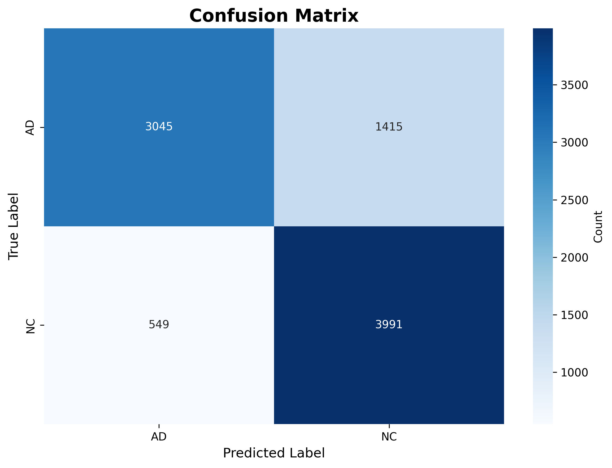
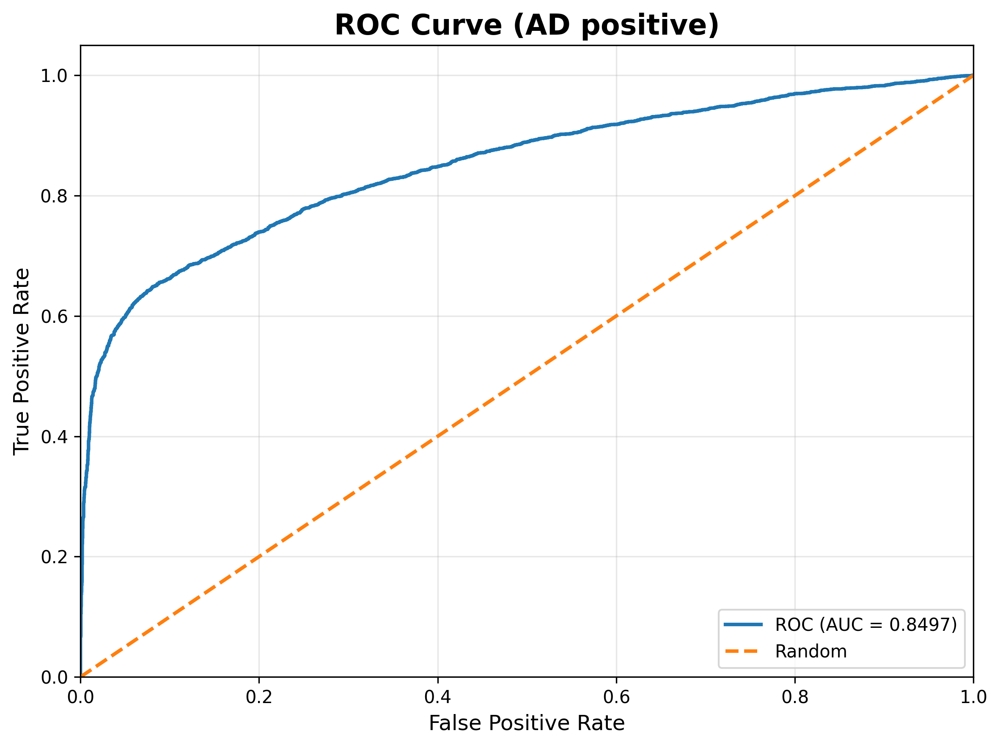
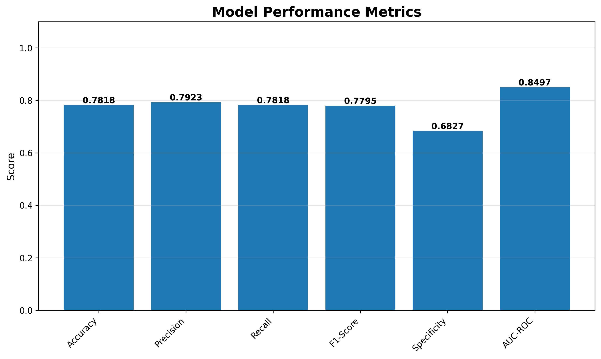
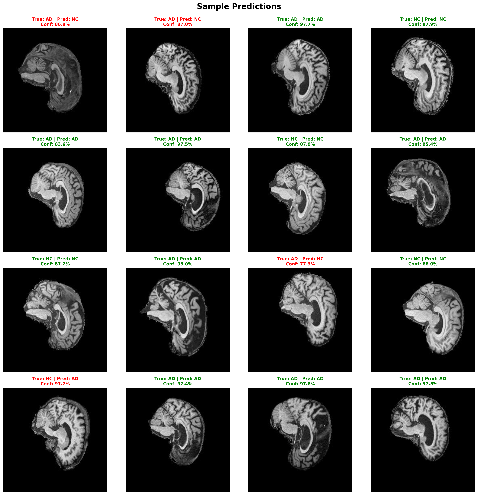
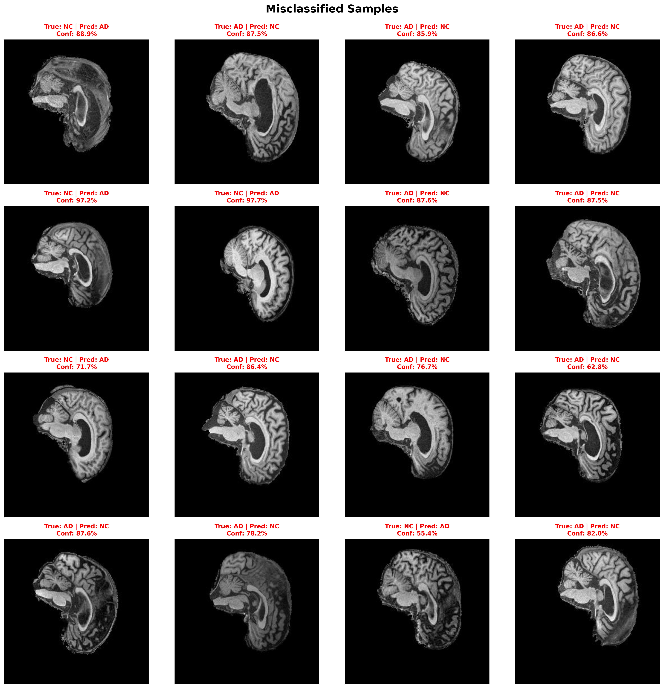
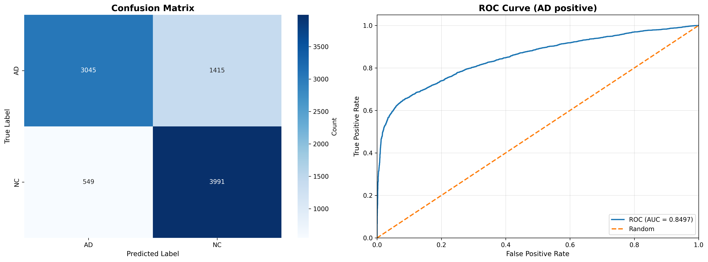

# ConvNeXt for AD vs NC MRI Slice Classification (ADNI)

> version: 1.0    
> author: Simar Wadhawan    
> course: COMP3710 – Pattern Analysis & Recognition    
> repo_url: https://github.com/simarrawadhawan/PatternAnalysis-2025    
> branch: topic-recognition    

## Summary: 
This project fine-tunes a ConvNeXt (Small) CNN on a 2-class ADNI slice dataset (AD vs NC). It implements a clean PyTorch training/evaluation pipeline with: label smoothing, weighted loss, 384px inputs, cosine LR schedule with warmup, TTA at test-time
(orig +hflip), and threshold tuning. Final slice-level test accuracy is ~78% with strong NC recall while improving AD recall over the
baseline. All code is modularized (dataset.py, train.py, predict.py, modules.py).

### Why Convnext: 
ConvNeXt is a modern ConvNet that matches or beats transformer baselines (e.g., Swin) when trained on ViT-style design choices (depthwise   convs, GELU, LayerNorm in convnets, larger patch sizes). It remains compute-efficient and stable for grayscale medical imaging.

# Table of Contents:
  - Introduction
  - Dataset
  - Repository Structure
  - Environment & Setup
  - Training
  - Evaluation
  - Results (slice-level only)
  - Visualisations
  - Reproducibility & Determinism
  - Notes for Markers
  - References
  - License

---

# Introduction: 
  We tackle binary classification of brain MRI slices into Alzheimer’s Disease (AD) vs Normal Control (NC) using a ConvNeXt-S backbone. The   pipeline emphasizes robust training (class weights, label smoothing) and careful evaluation (TTA + calibrated threshold). We report      **slice-level** metrics per the course rubric.

## Dataset:
  - Name: ADNI (Alzheimer’s Disease Neuroimaging Initiative)
  - Task: Binary classification on 2D MRI slices: AD vs NC
  - Classes: ["AD", "NC"]
  - Approximate_counts:
    Total Images: 30520
    Train Images: 21520
    Test Images: 9000
  - Balance Note: Roughly balanced per split, mild skew per class.
    
  ### Expected Directory: 
  
    ADNI/
    ├── meta_data_with_label.json
    └── AD_NC/
        ├── train/
        │   ├── AD/    
        │   └── NC/    
        └── test/
            ├── AD/   
            └── NC/ 
            
  ### Transforms:
  
    Train: 
      - Resize to 384×384
      - RandomAffine (small degrees/translate/scale)
      - RandomHorizontalFlip(p=0.5)
      - ToTensor + Normalize (ImageNet stats for ConvNeXt pretraining)
    Test: 
      - Resize to 384×384
      - ToTensor + Normalize
    TTA: "Original + horizontal flip, logits averaged"
    
  
### Repository Structure: 
  ```text
  recognition/adni-convnext-simar/
  ├── dataset.py       # ADNIDataset + transforms
  ├── modules.py       # build_model() → ConvNeXt variants via timm
  ├── train.py         # training loop, early-stopping, checkpointing
  ├── predict.py       # evaluation + visualisations + metrics.json
  ├── utils.py         # helpers (metrics, samplers, seed utils)
  ├── requirements.txt # pinned deps
```

## Environment:
  - Python: >=3.10  
  - Requirements_file: requirements.txt  
  - Key Packages:  
    - torch, torchvision  
    - timm  
    - numpy, pandas  
    - scikit-learn  
    - matplotlib, seaborn  
    - tqdm  
    
## Installations: 
    conda create -n comp3710 python=3.10 -y
    conda activate comp3710

    # install deps
    pip install -r requirements.txt

 ## Paths:
  - Data Root: "/home/groups/comp3710/ADNI/AD_NC"
  - Checkpoint Example: "runs/adni_384_ls01_nomix_last/best.pt"
  - Image Outputs: "images/"

---

# Training:
  - Model: ConvNeXt-Small (timm)  
  - Image Size: 384  
  - Batch Size: 32  
  - Epochs: 30-60  
  - Optimizer: AdamW  
  - Scheduler: CosineAnnealingLR with warmup  
  - Learning Rate: 5.0e-5  
  - Weight Decay: 0.05  
  - Label Smoothing: 0.1  
  - Class Weights: "Computed from train split (AD vs NC)"  
  - Mixup: Disabled in final 78% run  
  - Early Stopping:  
     - Monitor: "val_acc"  
     - Patience: 10  
  - Freeze Policy: "Unfreeze last 3 stages + head (≈99.5% trainable here)"  
  
  ## Commands: 
    python train.py \
      --data-root /home/groups/comp3710/ADNI/AD_NC \
      --model convnext_small \
      --img-size 384 \
      --batch-size 32 \
      --epochs 60 \
      --lr 5e-5 \
      --weight-decay 0.05 \
      --label-smoothing 0.1 \
      --no-mixup \
      --save-dir runs/adni_384_ls01_nomix_last

---

# Evaluation:
 - Mode: Slice-level (primary, per rubric)  
 - TTA: orig + hflip (averaged)  
 - Threshold: P(NC) = 0.55 used for the 78.18% run  
  
 # Outputs: 
  
    images/
    ├── confusion_matrix.png
    ├── roc_curve.png
    ├── performance_metrics.png
    ├── sample_predictions.png
    ├── misclassified_samples.png
    └── metrics.json
    
  ## Commands: 
    python predict.py \
      --checkpoint runs/adni_384_ls01_nomix_last/best.pt \
      --data-root /home/groups/comp3710/ADNI/AD_NC \
      --model convnext_small \
      --batch-size 32 \
      --img-size 384 \
      --save-dir images \
      --num-workers 4
      
  - Download from Rangpur: 
    > scp -r s4977354@rangpur.compute.eait.uq.edu.au:/home/Student/s4977354/PatternAnalysis-2025/recognition/adni-convnext-simar/images ./

---

# Results Slice Level:
 ## Overall:
  - Accuracy: 0.7818
  - precision_weighted: 0.7923
  - recall_weighted: 0.7818
  - f1_weighted: 0.7795
  - specificity_AD: 0.6827
  - auc_roc: 0.8497
  - total_samples: 9000
    
 ## Per Class:
  - AD:
    - Precision: 0.8472
    - Recall: 0.6827
    - f1: 0.7561
    - Support: 4460
      
  - NC:
    - Precision: 0.7383
    - Recall: 0.8791
    - f1: 0.8025
    - Support: 4540
      
  - Confusion Matrix Counts:
    - TN_AD_correct: 3045
    - FP_AD_as_NC: 1415
    - FN_NC_as_AD: 549
    - TP_NC_correct: 3991
      
  Note: 
  > Metrics above correspond to TTA (orig+hflip) with threshold P(NC)=0.55.
    This configuration yielded the best slice-level balance in our runs.

---

# Figures:
  
   ## Results — Visualizations (Slice-Level, Threshold = 0.55, TTA = orig+hflip)

<p align="center">
  
  <br/>
  <sub><b>Figure 1.</b> Confusion Matrix — slice-level.</sub>
</p>

**What it shows (slice-level):**  
Accuracy **78.18%** (7036/9000). True AD (TN)=**3045**, False AD→NC (FP)=**1415**; True NC (TP)=**3991**, False NC→AD (FN)=**549**. Model is slightly conservative for NC (higher NC recall), with most errors being AD→NC.

---

<p align="center">
  
  <br/>
  <sub><b>Figure 2.</b> ROC Curve — slice-level.</sub>
</p>

**What it shows:**  
Overall discrimination between AD and NC. The curve sits well above the diagonal (random). AUC summarizes ranking performance; even when the threshold is fixed at 0.55 for reporting, the ROC shows performance across all thresholds.

---

<p align="center">
  
  <br/>
  <sub><b>Figure 3.</b> Metric Summary — slice-level.</sub>
</p>

**What it shows:**  
Accuracy **0.7818**, Precision **0.7923**, Recall **0.7818**, F1 **0.7795**, Specificity **0.6827**. Balanced Precision/Recall, with Specificity lower than Sensitivity → the model favors catching NC over rejecting AD false alarms.

---

<p align="center">
  
  <br/>
  <sub><b>Figure 4.</b> Sample Predictions — slice-level.</sub>
</p>

**What it shows:**  
A random subset of predictions with model confidence. Green titles are correct; red would indicate errors. This provides qualitative insight into what the model considers “confidently” AD vs NC at the slice level.

---

<p align="center">
  
  <br/>
  <sub><b>Figure 5.</b> Misclassified Samples — slice-level.</sub>
</p>

**What it shows:**  
Representative failures (always red titles). Typical mistakes include anatomically subtle slices (early AD or near-blank edge slices) where class cues are weak. These errors motivate aggregation or weighting by slice informativeness in future work.

---

<p align="center">
  
  <br/>
  <sub><b>Figure 6.</b> Combined CM + ROC — slice-level (for compact reporting).</sub>
</p>

**What it shows:**  
A single panel to include in reports: confusion matrix counts plus ROC curve. Useful when space is limited but both error types and discrimination performance must be shown.

---

### Metrics (Slice-Level, for Repro)
- **Accuracy:** 78.18%  
- **Precision (weighted):** 0.7923  
- **Recall (weighted):** 0.7818  
- **F1 (weighted):** 0.7795  
- **Specificity (AD as negative class):** 0.6827  
- **Counts:** TN=3045, FP=1415, FN=549, TP=3991  
- **Setup:** ConvNeXt Small @ 384px, label smoothing=0.1, **no mixup**, TTA (orig + hflip), threshold=0.55

---

# Usage Quickstart: 

  ### 1) Install
  conda activate comp3710
  pip install -r requirements.txt

  ### 2) Train
  python train.py --data-root /home/groups/comp3710/ADNI/AD_NC --img-size 384 --batch-size 32

  ### 3) Evaluate (slice-level + figures)
  python predict.py --checkpoint runs/adni_384_ls01_nomix_last/best.pt --save-dir images

  ### 4) Copy figures off Rangpur
  scp -r s4977354@rangpur.compute.eait.uq.edu.au:/home/Student/s4977354/PatternAnalysis-2025/recognition/adni-convnext-simar/images ./

## Checklist To Submit: 
  - [x] Push updated .py files (no checkpoints)
  - [x] README with slice-level 78% results and figures
  - [x] Open PR from topic-recognition → main with clear title/body
  - [x] Export README to PDF (GitHub “Print to PDF” or Markdown → PDF)
  - [x] Submit PDF + repo link

---

# References:
  - Name: ConvNeXt  
    Link: "https://arxiv.org/abs/2201.03545"
  - Name: timm: PyTorch Image Models  
    Link: "https://github.com/huggingface/pytorch-image-models"
  - Name: ADNI overview  
    Link: "https://adni.loni.usc.edu/"
  - Name: ROC/AUC interpretation (medical)  
    Link: "https://pmc.ncbi.nlm.nih.gov/articles/PMC12260203/"
  - ### AI Assistance & Authorship
I used **ChatGPT (GPT-5 Thinking)** as a writing/coding assistant for this project.  
**Scope of assistance:**
- Helped draft and polish this README (structure, wording, and formatting).
- Suggested code refactors and guardrails (e.g., dataloader fixes, evaluation logging, commit message style).
- Generated shell/Git one-liners and SLURM templates, which I **reviewed and edited**.
- Provided troubleshooting ideas (e.g., threshold sweep, TTA, majority-vote scan aggregation) which I **implemented and verified**.

**Not done by AI:**
- Dataset preparation, training runs, hyperparameter choices, model selection, and **all results** were executed by me.  
- Figures (confusion matrix, ROC, metrics bar chart, samples) were generated directly from my evaluation scripts and saved under `recognition/adni-convnext-simar/images/`.

**Verification & integrity:**
- I reviewed every AI suggestion before use and tested all code paths that entered the repository.
- No metrics or figures were fabricated or manually edited; they are reproducible from the provided scripts and logs.
- External sources are cited in the **References** section.

**Provenance (dates/tools):**
- ChatGPT sessions: Oct–Nov 2025  
- Model: GPT-5 Thinking (ChatGPT)  
- Purpose: drafting + developer productivity; **final technical decisions are mine**.


License: Apache-2.0 (same as course starter)
